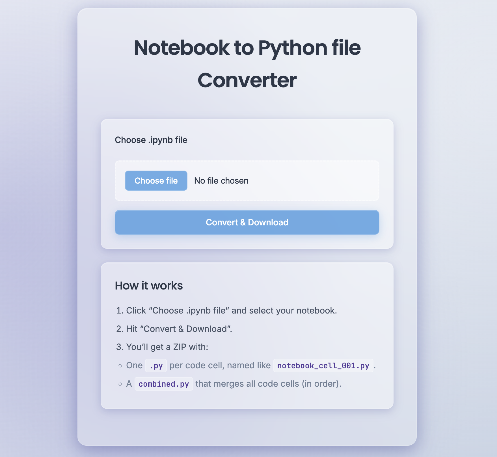

# Notebook to Python file Converter (Flask GUI)



A tiny Flask web app to convert a Jupyter Notebook (`.ipynb`) into **separate Python files** (one per code cell) and an optional **combined** Python file.

## About This Project

This web application provides a simple and elegant solution for converting Jupyter Notebooks into clean Python files. Built with Flask and featuring a modern glass morphism design, it allows developers and data scientists to easily extract code cells from their notebooks for better code organization and sharing.

### Why Use This Tool?
- **Clean Code Extraction**: Get properly formatted Python files without notebook metadata
- **Individual Cell Files**: Each code cell becomes a separate `.py` file for modular development
- **Combined Output**: Also generates a single file with all code cells merged
- **No Installation Hassle**: Simple web interface - no complex setup required
- **Privacy Focused**: All processing happens locally on your machine

### Libraries & Technologies Used
- **Flask 3.0.3** - Lightweight web framework for Python
- **Werkzeug** - WSGI utility library for secure file handling
- **Python Standard Library** - JSON parsing, file operations, and ZIP creation

## How to Use This Project Locally

### Prerequisites
- Python 3.7 or higher
- Git (for cloning the repository)

### Step-by-Step Setup
1. **Clone the repository**
   ```bash
   git clone https://github.com/thethakurshivam/Notebook-to-python-converter.git
   cd Notebook-to-python-converter
   ```

2. **Create a virtual environment (recommended)**
   ```bash
   python -m venv .venv
   ```

3. **Activate the virtual environment**
   ```bash
   # On Windows:
   .venv\Scripts\activate
   
   # On macOS/Linux:
   source .venv/bin/activate
   ```

4. **Install dependencies**
   ```bash
   pip install -r requirements.txt
   ```

5. **Run the application**
   ```bash
   python app.py
   ```

6. **Access the web interface**
   - Open your browser and go to `http://localhost:5000`
   - Upload your `.ipynb` file
   - Download the generated ZIP containing your Python files

## Features
- Upload a `.ipynb` and download a ZIP of `.py` files.
- Clean HTML/CSS interface (no JS build tools required).
- Uses only Python stdlib (`json`) to parse notebooks.
- Filenames include the base notebook name and cell index.

## Project Structure
```
notebook-to-python-converter/
├─ app.py
├─ templates/
│  └─ index.html
├─ static/
│  └─ styles.css
├─ utils/
│  └─ convert.py
└─ requirements.txt
```


## Notes
- Only code cells are exported. Markdown/raw cells are ignored.
- Output ZIP contains:
  - `your_notebook_cell_001.py`, `your_notebook_cell_002.py`, ...
  - `your_notebook_combined.py`
- If a notebook has **no code cells**, the app will show a friendly message.

## License

This project is licensed under the MIT License - see the [LICENSE](LICENSE) file for details.
